# Technical Specification: TeleMonitor AI

## 1. Project Overview

### 1.1 Project Identity
- **Project Name**: TeleMonitor AI
- **Purpose**: Development of an automated monitoring system for Telegram chats and channels to collect data, respond to real-time triggers, and generate daily analytical intelligence reports using LLM (GLM-4)

### 1.2 Key Features
- **Userbot Integration**: MTProto-based access to content on behalf of the user
- **Telegram Premium Features**: Voice message transcription capabilities
- **Catch-up Mechanism**: Recovery of missed messages during system downtime
- **ChatOps Management**: System control via Telegram bot interface

### 1.3 Technology Stack

| Component | Technology | Version/Details |
|-----------|-----------|-----------------|
| Programming Language | Go (Golang) | 1.22+ |
| Userbot Library | gotd | github.com/gotd/td |
| Bot Interface Library | telebot | gopkg.in/telebot.v3 |
| Database | PostgreSQL | 16 |
| AI Provider | ZhipuAI | GLM-4 / GLM-4-Flash |
| Infrastructure | Docker | Docker Compose |

## 2. System Architecture

### 2.1 Application Structure
The application is designed as a **monolithic Go application** running parallel processes (Goroutines):

```mermaid
graph TB
    subgraph "TeleMonitor AI Monolith"
        BotClient[Bot Client<br/>Admin Commands]
        UserbotClient[Userbot Client<br/>MTProto Updates]
        CronScheduler[Cron Scheduler<br/>Daily Analytics]
        
        subgraph "Core Services"
            AuthModule[Authentication Module]
            IngestionModule[Ingestion Layer]
            ReactorModule[Trigger Reactor]
            IntelligenceModule[AI Analytics]
        end
        
        BotClient --> AuthModule
        BotClient --> ReactorModule
        UserbotClient --> IngestionModule
        CronScheduler --> IntelligenceModule
        IngestionModule --> ReactorModule
    end
    
    TelegramAPI[Telegram API<br/>MTProto]
    AdminUser[Administrator]
    ZhipuAI[ZhipuAI API<br/>GLM-4]
    PostgresDB[(PostgreSQL)]
    
    AdminUser -->|Commands| BotClient
    UserbotClient <-->|MTProto| TelegramAPI
    BotClient -->|Alerts| AdminUser
    IntelligenceModule -->|API Calls| ZhipuAI
    Core Services -->|Data Operations| PostgresDB
```

### 2.2 Process Architecture

| Process | Responsibility | Lifecycle |
|---------|---------------|-----------|
| Bot Client | Listen and handle administrator commands | Continuous |
| Userbot Client | Monitor updates in target chats via MTProto | Continuous |
| Cron Scheduler | Trigger daily analytics generation | Scheduled (08:00) |

### 2.3 Security and Anti-Fraud Measures

#### Read-Only Mode
- Userbot operates in **strict read-only mode**
- Never writes or sends messages to monitored chats
- Only observes and collects data

#### Client Masquerading
The Userbot client parameters emulate official Telegram Desktop for Windows:

| Parameter | Value Strategy |
|-----------|---------------|
| DeviceModel | Windows Desktop |
| AppVersion | Match official Telegram Desktop |
| SystemVersion | Windows 10/11 |

#### Rate Limiting and Delays
- **Chat joining**: Random delay between operations
- **Heavy requests**: Randomized intervals to mimic human behavior
- **Transcription requests**: Throttled to avoid detection

## 3. Data Model

### 3.1 Database Schema

#### session_storage
Stores encryption keys for Userbot session persistence.

| Column | Type | Constraints | Description |
|--------|------|-------------|-------------|
| key | TEXT | PRIMARY KEY | Session identifier |
| value | BYTEA | NOT NULL | Binary session data from gotd |

**Purpose**: Critical for maintaining authorization across container restarts

---

#### monitored_chats
Registry of monitoring sources.

| Column | Type | Constraints | Description |
|--------|------|-------------|-------------|
| chat_id | BIGINT | PRIMARY KEY | Telegram chat identifier |
| title | TEXT | | Chat display name |
| username | TEXT | | Chat username (if public) |
| last_processed_msg_id | INTEGER | DEFAULT 0 | Last processed message ID |
| last_pts | INTEGER | DEFAULT 0 | Telegram Updates State for catch-up |
| is_active | BOOLEAN | DEFAULT TRUE | Monitoring status flag |
| added_at | TIMESTAMP | DEFAULT NOW() | Registration timestamp |

**Indexes Required**:
- Primary: chat_id
- Filter: is_active

---

#### raw_messages
Message archive with 7-day retention policy.

| Column | Type | Constraints | Description |
|--------|------|-------------|-------------|
| id | SERIAL | PRIMARY KEY | Internal record ID |
| chat_id | BIGINT | FOREIGN KEY → monitored_chats | Source chat reference |
| telegram_msg_id | INTEGER | NOT NULL | Original Telegram message ID |
| sender_id | BIGINT | | Message author's Telegram ID |
| sender_name | TEXT | | Author's display name |
| message_text | TEXT | | Text content or transcription result |
| is_transcribed | BOOLEAN | DEFAULT FALSE | Voice message flag |
| is_forward | BOOLEAN | DEFAULT FALSE | Forwarded message indicator |
| forward_source_name | TEXT | | Original source of forwarded content |
| created_at | TIMESTAMP | NOT NULL | Message send time (author's timestamp) |
| saved_at | TIMESTAMP | DEFAULT NOW() | Database insertion time |

**Unique Constraint**: (chat_id, telegram_msg_id)

**Indexes Required**:
- Primary: id
- Unique: (chat_id, telegram_msg_id)
- Filter: created_at (for time-based queries)

**Data Retention**: Automated cleanup via cron removes records older than 7 days

---

#### triggers
Keyword definitions for instant alerts.

| Column | Type | Constraints | Description |
|--------|------|-------------|-------------|
| id | SERIAL | PRIMARY KEY | Trigger identifier |
| phrase | TEXT | NOT NULL | Keyword or pattern to match |
| is_regex | BOOLEAN | DEFAULT FALSE | Pattern type indicator |
| alert_level | VARCHAR(20) | DEFAULT 'info' | Severity: info, warning, critical |

**Alert Levels**:
- `info`: Informational notification
- `warning`: Attention required
- `critical`: Immediate action needed

---

#### daily_reports
AI-generated analytical reports with indefinite retention.

| Column | Type | Constraints | Description |
|--------|------|-------------|-------------|
| id | SERIAL | PRIMARY KEY | Report identifier |
| chat_id | BIGINT | FOREIGN KEY → monitored_chats | Target chat reference |
| report_date | DATE | NOT NULL | Report coverage date |
| summary | TEXT | | Markdown-formatted summary from GLM |
| full_json | JSONB | | Complete model response |
| created_at | TIMESTAMP | DEFAULT NOW() | Report generation timestamp |

**Unique Constraint**: (chat_id, report_date)

**Indexes Required**:
- Primary: id
- Unique: (chat_id, report_date)
- Filter: report_date

---

### 3.2 Data Flow Diagram


## 4. Functional Modules

### 4.1 Authentication Module (Auth Flow)

Since there is no GUI, Userbot authentication occurs through the bot interface.

#### Authentication Sequence

```mermaid
sequenceDiagram
    participant Admin
    participant Bot
    participant Userbot
    participant TelegramAPI
    participant Database
    
    Admin->>Bot: /login
    Bot->>Userbot: Initialize Client
    Userbot->>TelegramAPI: Request Auth Code
    TelegramAPI-->>Userbot: Code Sent to Phone
    Bot->>Admin: "Enter verification code"
    Admin->>Bot: 12345
    Bot->>Userbot: Submit Code
    Userbot->>TelegramAPI: Verify Code
    
    alt 2FA Enabled
        TelegramAPI-->>Userbot: Request Password
        Bot->>Admin: "Enter 2FA password"
        Admin->>Bot: password123
        Bot->>Userbot: Submit Password
        Userbot->>TelegramAPI: Verify Password
    end
    
    TelegramAPI-->>Userbot: Session Authorized
    Userbot->>Database: Save to session_storage
    Bot->>Admin: ✅ "Login successful"
```



#### State Management
- **Session Persistence**: All authentication data stored in `session_storage` table
- **Container Restart**: Session automatically restored from database
- **Logout Flow**: Session removed from database, client disconnected

---

### 4.2 Ingestion Layer (Data Collection Module)

#### Dual Collection Strategy

| Mode | Description | Trigger |
|------|-------------|---------|
| Real-time | Listens to `OnMessage` events | Continuous |
| Catch-up | Recovers missed messages during downtime | Startup |

#### Real-time Collection Flow


#### Catch-up Mechanism

On system startup:
1. Read `last_pts` from `monitored_chats` for each active chat
2. Query Telegram API for current server state
3. Calculate difference using `updates.getDifference`
4. Process all missed updates in chronological order
5. Update `last_pts` after successful processing

#### Content Processing Rules

| Content Type | Processing Strategy |
|--------------|---------------------|
| Text Message | Direct extraction and storage |
| Photo/Video Caption | Extract caption as message_text |
| Forwarded Content | Extract original content, store forward_source_name |
| Voice Message | Transcribe using Telegram Premium API if available |
| Video Circle | Transcribe using Telegram Premium API if available |
| Sticker/GIF | Skip or store metadata only |
| Document | Store filename and caption |

---

### 4.3 Trigger Reactor Module

Operates **before** database storage to enable real-time alerts.

#### Trigger Matching Flow


#### Alert Message Format

**Template Structure**:
```
🔔 **Trigger Alert:** [Matched Keyword]
**Level:** [info/warning/critical]
**Chat:** [Chat Title]
**User:** @[username]
**Text:** [Message excerpt...]
**Time:** [Timestamp]
```

#### Trigger Processing Rules
- **Text Normalization**: Convert to lowercase before matching
- **Regex Support**: If `is_regex = true`, use regex pattern matching
- **Multiple Matches**: Send separate alert for each matched trigger
- **Performance**: Cache trigger list in memory, refresh every 5 minutes

---

### 4.4 AI Analytics Module (Intelligence)

Scheduled execution at 08:00 daily or on-demand via `/report_now` command.

#### Report Generation Workflow


#### Prompt Engineering Strategy

**Context Compilation**:
- Aggregate all messages from the last 24 hours for the target chat
- Include metadata: sender names, timestamps, forward sources
- Exclude system messages and service notifications

**Instruction Template**:
```
You are an intelligence analyst. Analyze the following Telegram chat messages and provide:

1. **Top 3 Themes**: Identify the three most discussed topics
2. **Brand Sentiment**: Analyze mentions of specific brands/projects
3. **Key Insights**: Notable developments, announcements, or trends
4. **Reference Links**: Extract all URLs and categorize by relevance

Messages:
[Aggregated message text with metadata]

Respond in structured format.
```

#### ZhipuAI Integration Parameters

| Parameter | Value | Purpose |
|-----------|-------|---------|
| Model | glm-4 or glm-4-flash | Balance between quality and speed |
| Temperature | 0.3 | Consistency in analytical output |
| Max Tokens | 2000 | Sufficient for detailed reports |
| Top P | 0.7 | Focused output generation |

#### Report Storage Structure

**summary field**: Markdown-formatted human-readable report
**full_json field**: Complete API response including:
- Model metadata
- Token usage statistics
- Raw structured output
- Confidence scores (if available)

## 5. Bot Interface (ChatOps Commands)

### 5.1 Command Categories

#### System Management

| Command | Parameters | Description | Access Level |
|---------|-----------|-------------|--------------|
| `/start` | None | Verify admin access via whitelist | Admin only |
| `/status` | None | Display system health (uptime, message count, userbot status) | Admin only |
| `/login` | None | Initiate Userbot authentication flow | Admin only |
| `/logout` | None | Terminate Userbot session and clear database | Admin only |

**Status Output Example**:
```
🟢 System Status

Userbot: Connected
Uptime: 3d 14h 22m
Messages Processed: 15,847
Active Chats: 12
Last Report: 2024-01-15 08:00
Database: Healthy
```

---

#### Monitoring Management

| Command | Parameters | Description | Access Level |
|---------|-----------|-------------|--------------|
| `/chats` | None | List all monitored chats with status | Admin only |
| `/add_chat` | `[link\|username]` | Add chat to monitoring list | Admin only |
| `/list_dialogs` | `[n]` (optional, default: 20) | Show last N dialogs from account | Admin only |
| `/del_chat` | `[chat_id]` | Remove chat from monitoring | Admin only |

**Chat List Output Format**:
```
📋 Monitored Chats

1. CryptoInsider (@cryptoinsider)
   ID: -1001234567890
   Status: ✅ Active
   Last Message: 2 min ago

2. Trading Signals (Private)
   ID: -1009876543210
   Status: ⏸️ Paused
   Last Message: 1 hour ago
```

**Add Chat Flow**:
- Public chat: `/add_chat @channelname` or `/add_chat https://t.me/channelname`
- Private chat: Use `/list_dialogs` to find chat, then `/add_chat [chat_id]`

---

#### Trigger Management

| Command | Parameters | Description | Access Level |
|---------|-----------|-------------|--------------|
| `/triggers` | None | Display all active triggers | Admin only |
| `/add_trigger` | `[phrase]` `[level]` (optional) | Create new trigger keyword | Admin only |
| `/del_trigger` | `[trigger_id]` | Remove trigger by ID | Admin only |

**Trigger List Output**:
```
🔔 Active Triggers

1. ID: 5
   Phrase: "scam project"
   Type: Text Match
   Level: warning

2. ID: 7
   Phrase: \b(hack|breach)\b
   Type: Regex
   Level: critical
```

---

#### Analytics and Reporting

| Command | Parameters | Description | Access Level |
|---------|-----------|-------------|--------------|
| `/report_now` | `[chat_id]` (optional) | Generate immediate report for today | Admin only |
| `/ask` | `[query]` | Search historical reports (RAG-style) | Admin only |

**Report Now Behavior**:
- Without parameter: Generate reports for all active chats
- With chat_id: Generate report only for specified chat
- Time range: Always covers last 24 hours from execution time

**Ask Command** (Future Enhancement):
- Simple SQL text search: `WHERE summary LIKE '%query%'`
- Vector search: If pgvector extension implemented

### 5.2 Access Control

**Whitelist Mechanism**:
- Admin Telegram User ID stored in configuration
- All commands check sender ID against whitelist
- Unauthorized requests receive no response (silent rejection)

**Security Considerations**:
- No public bot endpoints
- Rate limiting on command execution
- Audit log for administrative actions (future enhancement)

## 6. Configuration Management

### 6.1 Configuration Sources

Configuration loaded from **multiple sources** with priority order:

1. Environment variables (highest priority)
2. `config.yaml` file
3. Default values (lowest priority)

### 6.2 Configuration Schema

#### config.yaml Structure

```yaml
telegram:
  # Userbot credentials
  app_id: 12345
  app_hash: "your_app_hash_here"
  
  # Bot credentials
  bot_token: "your_bot_token_here"
  
  # Access control
  admin_id: 999999  # Telegram User ID of owner

  # Client masquerading
  device_model: "Desktop"
  system_version: "Windows 10"
  app_version: "4.9.0"

ai:
  # ZhipuAI configuration
  zhipu_api_key: "your_zhipu_api_key"
  model: "glm-4"  # or "glm-4-flash"
  
  # Generation parameters
  temperature: 0.3
  max_tokens: 2000

database:
  host: "localhost"
  port: 5432
  name: "telemonitor"
  user: "telemonitor_user"
  password: "secure_password"
  ssl_mode: "disable"  # "require" for production

scheduler:
  # Daily report generation time (24h format)
  report_time: "08:00"
  
  # Data retention
  raw_messages_retention_days: 7

rate_limiting:
  # Anti-fraud delays (milliseconds)
  min_delay: 1000
  max_delay: 5000
  
  # Transcription throttling
  transcriptions_per_minute: 10
```

### 6.3 Environment Variable Mapping

| Environment Variable | Config Path | Example Value |
|---------------------|-------------|---------------|
| `TG_APP_ID` | telegram.app_id | `12345` |
| `TG_APP_HASH` | telegram.app_hash | `abc123...` |
| `TG_BOT_TOKEN` | telegram.bot_token | `123:ABC...` |
| `TG_ADMIN_ID` | telegram.admin_id | `999999` |
| `ZHIPU_API_KEY` | ai.zhipu_api_key | `sk-...` |
| `DB_HOST` | database.host | `postgres` |
| `DB_PASSWORD` | database.password | `secret` |

### 6.4 Configuration Validation

On application startup, the system must validate:
- All required fields are present
- Admin ID is a valid Telegram user identifier
- Database connection is successful
- API credentials are valid (test call)

**Validation Failure Behavior**: Application refuses to start, logs specific missing configuration

## 7. Development Roadmap

### 7.1 Phase 1: Foundation (Week 1)

#### Objective
Establish project infrastructure and database foundation.

**Tasks**:
1. **Project Initialization**
   - Create Go module structure
   - Configure Docker Compose for PostgreSQL 16
   - Set up development environment

2. **Database Layer**
   - Implement SQL migration scripts for all tables
   - Create Go structs for all entities
   - Build Repository pattern for database operations
   - Implement session storage persistence logic

**Deliverables**:
- Functional PostgreSQL container
- Complete database schema
- Repository layer with CRUD operations

---

### 7.2 Phase 2: Userbot Core (Week 2)

#### Objective
Implement MTProto client and authentication.

**Tasks**:
1. **Userbot Client Setup**
   - Integrate `gotd` library
   - Configure client parameters for anti-detection
   - Implement session management using database backend

2. **Authentication Flow**
   - Build channel-based communication between Bot and Userbot
   - Implement phone code verification flow
   - Handle 2FA password authentication
   - Test session persistence across restarts

**Deliverables**:
- Functional Userbot client
- Complete authentication mechanism
- Session recovery capability

---

### 7.3 Phase 3: Bot Interface (Week 2-3)

#### Objective
Create administrative command interface.

**Tasks**:
1. **Bot Client Integration**
   - Integrate `telebot.v3` library
   - Implement whitelist access control
   - Build command handlers for system management

2. **Core Commands**
   - `/login`, `/logout`, `/status`
   - `/chats`, `/add_chat`, `/del_chat`, `/list_dialogs`
   - Error handling and user feedback

**Deliverables**:
- Functional bot interface
- All management commands operational
- Bot-Userbot communication bridge

---

### 7.4 Phase 4: Ingestion & Catch-up (Week 3-4)

#### Objective
Implement message collection and recovery mechanisms.

**Tasks**:
1. **Real-time Collection**
   - Subscribe to MTProto updates
   - Handle different message types (text, media, forwards)
   - Implement Premium transcription for voice messages

2. **Catch-up Logic**
   - Build `updates.getDifference` integration
   - Implement state tracking with `last_pts`
   - Handle large message backlogs efficiently

3. **Content Processing**
   - Text extraction
   - Forward detection and source tracking
   - Transcription request handling

**Deliverables**:
- Real-time message ingestion
- Catch-up mechanism tested with simulated downtime
- Support for all major message types

---

### 7.5 Phase 5: Trigger System (Week 4)

#### Objective
Build real-time keyword alert system.

**Tasks**:
1. **Trigger Engine**
   - Implement text normalization
   - Build pattern matching (literal and regex)
   - Create in-memory trigger cache with refresh mechanism

2. **Alert Delivery**
   - Format alert messages with context
   - Send notifications via bot interface
   - Implement alert level differentiation

3. **Management Commands**
   - `/triggers`, `/add_trigger`, `/del_trigger`

**Deliverables**:
- Functional trigger reactor
- Real-time alerts to administrator
- Trigger management interface

---

### 7.6 Phase 6: AI Analytics (Week 5)

#### Objective
Integrate LLM-based intelligence generation.

**Tasks**:
1. **ZhipuAI Integration**
   - Implement SDK/API client
   - Build prompt engineering templates
   - Handle API responses and errors

2. **Report Generation**
   - Aggregate messages by chat and time range
   - Generate structured prompts
   - Parse and store AI outputs

3. **Scheduler**
   - Implement cron-based daily execution
   - Build `/report_now` command
   - Format and deliver reports to admin

**Deliverables**:
- Daily automated reports
- On-demand report generation
- Report history in database

---

### 7.7 Phase 7: Testing & Optimization (Week 6)

#### Objective
Ensure system stability and performance.

**Tasks**:
1. **Testing**
   - Unit tests for core modules
   - Integration tests for end-to-end flows
   - Load testing with high message volume

2. **Optimization**
   - Database query optimization
   - Memory usage profiling
   - API rate limiting refinement

3. **Documentation**
   - Deployment guide
   - Configuration reference
   - Operational runbook

**Deliverables**:
- Test coverage report
- Performance benchmarks
- Complete documentation

---

### 7.8 Phase 8: Deployment (Week 6)

#### Objective
Production deployment and monitoring.

**Tasks**:
1. **Containerization**
   - Finalize Docker images
   - Configure production Docker Compose
   - Set up volume management for persistence

2. **Deployment**
   - Production environment setup
   - Configuration validation
   - Initial data migration

3. **Monitoring**
   - Application logging
   - Error tracking
   - Health check endpoints

**Deliverables**:
- Production-ready deployment
- Monitoring dashboards
- Incident response procedures

## 8. Non-Functional Requirements

### 8.1 Performance

| Metric | Target | Measurement |
|--------|--------|-------------|
| Message Processing Latency | < 2 seconds | From receipt to database storage |
| Trigger Alert Delay | < 5 seconds | From detection to admin notification |
| Report Generation Time | < 60 seconds | Per chat for 24h message batch |
| Database Query Response | < 100ms | For 95th percentile |
| Catch-up Speed | > 100 messages/second | During recovery from downtime |

### 8.2 Reliability

**Uptime Target**: 99.5% monthly availability

**Fault Tolerance**:
- Automatic reconnection on network failures
- Session persistence across crashes
- Message queue for temporary API unavailability

**Data Integrity**:
- Transaction-based database operations
- Duplicate message prevention via unique constraints
- Catch-up mechanism prevents data loss during downtime

### 8.3 Scalability

**Current Scope**:
- Support for up to 50 monitored chats
- Process up to 10,000 messages per day
- Single administrator user

**Future Scaling Considerations**:
- Horizontal scaling not required (single user system)
- Database partitioning if message volume exceeds 1M records
- Message processing queue if real-time lag occurs

### 8.4 Security

**Authentication**:
- Telegram's MTProto encryption for all communications
- Session keys stored encrypted in database
- Bot access restricted to single admin ID

**Data Protection**:
- No plaintext storage of sensitive credentials
- Environment variable injection for secrets
- Database connection over SSL in production

**Privacy**:
- Read-only access to monitored chats
- No data sharing with third parties
- Local data retention with automatic cleanup

### 8.5 Maintainability

**Code Standards**:
- Go standard library conventions
- Comprehensive inline documentation
- Structured logging for debugging

**Monitoring**:
- Application health metrics exposed via `/status` command
- Error logging to stdout for container log aggregation
- Database connection pool monitoring

**Backup Strategy**:
- Daily PostgreSQL backups
- Session storage backup before upgrades
- Configuration version control

## 9. Risk Assessment

### 9.1 Technical Risks

| Risk | Probability | Impact | Mitigation Strategy |
|------|------------|--------|---------------------|
| Telegram API Changes | Medium | High | Monitor gotd library updates, implement adapter layer |
| Premium Transcription Limits | Medium | Medium | Implement fallback for voice messages, notify admin |
| ZhipuAI API Rate Limiting | Low | Medium | Implement retry logic with exponential backoff |
| Database Storage Growth | Medium | Low | Enforce 7-day retention, monitor disk usage |
| Userbot Detection/Ban | Low | Critical | Strict read-only mode, human-like delays, official client emulation |

### 9.2 Operational Risks

| Risk | Probability | Impact | Mitigation Strategy |
|------|------------|--------|---------------------|
| Container Crashes | Low | Medium | Auto-restart policy, session persistence |
| Network Connectivity Loss | Medium | Medium | Automatic reconnection, catch-up on recovery |
| Admin Phone Loss | Low | High | Document session backup/restore procedure |
| Disk Space Exhaustion | Low | High | Automated cleanup cron, monitoring alerts |

### 9.3 Compliance Risks

| Risk | Probability | Impact | Mitigation Strategy |
|------|------------|--------|---------------------|
| Telegram ToS Violation | Low | Critical | Read-only mode, no automation in sending messages |
| GDPR Data Handling | Low | Medium | Local storage only, no third-party sharing, retention policy |
| AI Content Guidelines | Low | Low | Review ZhipuAI acceptable use policy |

## 10. Success Criteria

### 10.1 Functional Success

- [ ] Userbot successfully authenticates and maintains session
- [ ] All monitored chats receive real-time message ingestion
- [ ] Trigger alerts delivered within 5 seconds of keyword detection
- [ ] Daily reports generated automatically at scheduled time
- [ ] Catch-up recovers all missed messages after downtime
- [ ] Voice transcription works for Premium account
- [ ] All bot commands respond correctly

### 10.2 Technical Success

- [ ] Zero data loss during normal operation
- [ ] System recovers automatically from network failures
- [ ] Database queries execute within performance targets
- [ ] No Telegram API violations or account restrictions
- [ ] Container restarts preserve all state

### 10.3 User Experience Success

- [ ] Administrator receives timely and actionable alerts
- [ ] Reports provide clear intelligence value
- [ ] Bot interface is intuitive and responsive
- [ ] System operates without manual intervention
- [ ] Error messages are clear and actionable
